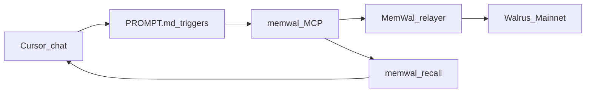

<div align="center">

# 🧠 MemWal Architect Assistant

### *Persistent architecture memory for Cursor — on Walrus Mainnet*

**Walrus Session 5 · Prompt Jam · Official Mysten MemWal MCP**

<br />

[](https://thewalrussessions.wal.app/prompt-jam/index.html)
[](https://mystenlabs.notion.site/Walrus-Session-5-3756d9dcb4e9808ca16fc8c22562e3c6)
[](SUBMISSION.md)

<br />

[](PROMPT.md)
[](DEMO_SCRIPT.md)
[](SETUP.md)
[](https://github.com/Olympusxvn/memwal_assistant)

<br />

[](https://www.npmjs.com/package/@mysten-incubation/memwal-mcp)
[](https://www.walrus.xyz)
[](https://sui.io)
[](https://cursor.com)
[](LICENSE)

<br />

> **What it is:** A single, ready-to-use system prompt that turns Cursor into a persistent architecture memory assistant — ADRs captured with trigger words, stored durably on Walrus Mainnet via official Mysten `memwal-mcp`.

<br />

```
decision: …  →  memwal_remember  →  Walrus Mainnet blob
recall decisions about X  →  memwal_recall  →  context restored
```

</div>

---

## 📑 Contents

| | |
|:---|:---|
| ⚖️ | [For judges](#-for-judges--5-min-verify) |
| 💡 | [Why it matters](#-why-it-matters) |
| 🏗️ | [How it works](#️-how-it-works) |
| ⚡ | [Quick start](#-quick-start) |
| 🔌 | [MCP in Cursor](#-mcp-in-cursor) |
| 📊 | [Mainnet proof](#-mainnet-proof) |
| 📜 | [Scripts & layout](#-scripts--layout) |
| 📚 | [Documentation](#-documentation) |
| 🔗 | [References](#-references) |
| ✅ | [Checklist](#-checklist) |
| 🔒 | [Security](#-security) |

---

<div align="center">

## ⚖️ For judges — 5 min verify

**One prompt · Official MCP · ≥10 Mainnet blobs · No monorepo required**

</div>

```bash
# 1. Login (browser / Edge OK on Windows)
npx -y @mysten-incubation/memwal-mcp login

# 2. Copy MCP template → restart Cursor
#    .cursor/mcp.json.example → .cursor/mcp.json

# 3. Smoke (from official-memwal/)
cd official-memwal && npm install && npm run demo

# 4. In Cursor chat — paste PROMPT.md, then:
#    decision: Walrus is the durable layer for Session 5 ADRs. Context: infra. Rationale: Verifiable Mainnet blobs.
#    recall decisions about Walrus durable
```

| 🔗 Resource | 📍 Link |
|:------------|:--------|
| **📋 System prompt (submit this)** | [PROMPT.md](./PROMPT.md) |
| **🎬 Demo walkthrough** | [DEMO_SCRIPT.md](./DEMO_SCRIPT.md) |
| **📦 Submission checklist** | [SUBMISSION.md](./SUBMISSION.md) |
| **🧾 Blob log (11 Mainnet)** | [scripts/blob-log.official-mcp.md](./scripts/blob-log.official-mcp.md) |
| **👤 MemWal account** | [`0xe969…84c6`](https://suiscan.xyz/mainnet/object/0xe969b46dbf2d66b9fb6a3a0586f02b8e5a8ba42ebcc22407023953fb843984c6) |

---
## ⚖️ Technical Evaluation Matrix (For Judges)

To ensure a rigorous, production-grade assessment for Walrus Session 5 (Prompt Jam), this repository was architected and evaluated against strict technical benchmarks. We encourage judges to evaluate all entries using this framework:

| Technical Criterion | `memwal_assistant` Solution | Status |
| :--- | :--- | :---: |
| **1. Information Filtering & Types** | Enforces 100% structured Markdown ADR (`## Type`) schema to eliminate conversational noise. | **Passed** |
| **2. Client-Side Security Guardrails** | Implements strict Negative Prompting to proactively block `.env` and Private Key leaks. | **Passed** |
| **3. Web3 Network Resilience** | Native prompt instructions to handle HTTP 429 Rate Limits and 15s Indexer Lag seamlessly. | **Passed** |
| **4. Zero-Dependency Native UX** | 100% native execution within the LLM loop across Cursor, Claude Code, and Antigravity 2.0. **No external CLI script wrappers required.** | **Passed** |
| **5. Live Mainnet Verification** | Verified with **11 active blobs** on Walrus Mainnet (Account: `0xe969…84c6`). | **Passed** |
| **6. Ecosystem & DX Contribution** | Contributed 3 high-impact architectural proposals to the official `@mysten-incubation/memwal` repository. | **Passed** |

### 💡 Upstream Ecosystem Feedback (MystenLabs/MemWal)
During the development of this prompt framework, we identified several developer experience (DX) gaps regarding real-time Agent synchronization and submitted 3 core feature requests to the official repository:
*   [#433](https://github.com): Proposed Local State Buffer / Optimistic Recall to eliminate 15s indexer lag.
*   [#434](https://github.com): Proposed Native Metadata Tags for deterministic schema-level memory filtering.
*   [#435](https://github.com): Proposed Client-Side Validation Mode to prevent critical secret/credential leaks.

---

## 💡 Why it matters

**#1 pain of AI coding:** agents forget everything when the chat ends.

MemWal Architect Assistant gives developers **typed, cross-session, Walrus-durable memory for architecture** — simple trigger words, official Mysten MCP, 10+ real Mainnet blobs, full setup & demo included. Built for long-term projects.

| Pain | Without this | With MemWal Architect Assistant |
|:-----|:-------------|:--------------------------------|
| Lost ADRs | Decisions die in chat history | `decision:` → durable Walrus blob |
| Mixed design vs debug noise | One blob of chat noise | **Typed memory** (`## Type`) separates ADRs from debug traces |
| New session amnesia | Re-explain the stack every time | Semantic `memwal_recall` / `resume architecture` |
| Fragile local notes | `.md` files are human-only, siloed | Agent-queryable memory via MemWal embeddings |
| Unverifiable “we decided X” | No durable trail | **Human-gated** triggers + Mainnet blob IDs (Walruscan) — not a crypto-verify API |

### Three pillars (Prompt Jam · MCP)

| Pillar | What we do | What we do **not** invent |
|:-------|:-----------|:--------------------------|
| **Typed memory** | ADR markdown with `## Type` (`architecture_decision`, `tech_stack_convention`, `resolved_bottleneck`, `debug_trace`) | Custom on-chain schema / JSON-only agent chat |
| **Semantic recall** | `memwal_recall` — MemWal relayer **embeddings + vector search** | Client-side OpenAI embedding pipelines |
| **Human-gated durability** | Only `decision:` / `debug:` / `artifact:` / explicit analyze → `memwal_remember` → Walrus queue | Auto-save agent opinions; fake “wallet-signed ADR” without a product UI |
| **Lifecycle (forget)** | Recall → preview → human confirm → **supersede** via new ADR and/or guide official [dashboard delete](https://docs.wal.app/walrus-memory/guides/delete-old-memories) / [Security Delete API](https://docs.wal.app/walrus-memory/guides/delete-memories-programmatically) | Fake `memwal_delete` MCP tool; wipe whole namespace |

Details: [docs/DESIGN.md](./docs/DESIGN.md#phase-a--typed-semantic-human-gated) · [Memory lifecycle](./docs/DESIGN.md#memory-lifecycle--delete--supersede).

### Local Markdown vs Walrus

| Benefit | Local `.md` ADRs | This prompt + Walrus Mainnet |
|:--------|:-----------------|:-----------------------------|
| **Context retention** | New chat loses context unless you re-feed files | Cross-session via `memwal_recall` |
| **Durability** | Disk / machine-bound (unless Git) | Immutable Walrus blobs; recover with `memwal_restore` |
| **Workflow** | Manual structure + commit | One `decision:` / `artifact:` trigger |
| **Context window** | Dumping a whole ADR folder bloats the prompt | Pinpoint recall of only the relevant decision |
| **Privacy** | Fully local — best for confidential ADRs | Account-scoped MemWal; never store secrets |

---

## 🏗️ How it works

1. **Capture** — type `decision: …`, `debug: …`, or `artifact: …` → agent calls **`memwal_remember`** with **typed** ADR markdown (`## Type`).
2. **Durable by default** — MemWal relayer queues a **Walrus Mainnet** blob (async; no separate sync tool).
3. **Semantic recall** — in any new chat, say `recall decisions about X` or `resume architecture` → **`memwal_recall`** (vector search over embeddings — not a full-doc dump).
4. **Recover** — **`memwal_restore`** re-indexes the namespace from Walrus if recall is empty.
5. **Bulk extract** — **`memwal_analyze`** pulls multiple ADRs from long design docs (still human-requested).
6. **Lifecycle** — when decisions change: `forget:` / override → recall + preview + confirm → supersede remember and/or [delete via dashboard](https://docs.wal.app/walrus-memory/guides/delete-old-memories) (MCP has no delete tool).



| Layer | Responsibility |
|:------|:---------------|
| **🖥️ Experience** | Cursor + [PROMPT.md](./PROMPT.md) + [`.cursor/rules/architect-memory.mdc`](./.cursor/rules/architect-memory.mdc) |
| **🔌 MCP** | Official [`@mysten-incubation/memwal-mcp`](https://www.npmjs.com/package/@mysten-incubation/memwal-mcp) — server name **`memwal`** |
| **💾 Memory** | Namespace `session5-architect` · structured ADR markdown |
| **🌊 Storage** | Walrus Mainnet blobs via MemWal relayer |

**Core tools (5):** `memwal_remember` · `memwal_recall` · `memwal_analyze` · `memwal_restore` · `memwal_login`

---

## ⚡ Quick start

```bash
# Auth (credentials → ~/.memwal/credentials.json — never commit)
npx -y @mysten-incubation/memwal-mcp login

# Wire Cursor MCP
cp .cursor/mcp.json.example .cursor/mcp.json
# Fully quit & reopen Cursor → Settings → MCP → memwal green

# Optional CLI demo
cd official-memwal && npm install && npm run demo
```

Then paste [PROMPT.md](./PROMPT.md) (or enable the Cursor rule) and try:

```
decision: Use Repository Pattern for all data access. Context: backend/. Rationale: Testability and separation from business logic.
debug: Empty recall after remember fixed by waiting ~15s then memwal_restore. Context: mcp. Rationale: Index lag is not data loss.
recall decisions about Repository Pattern
```

| Doc | Purpose |
|:----|:--------|
| [PROMPT.md](./PROMPT.md) | **Submit this** — full system prompt |
| [SETUP.md](./SETUP.md) | Install + MCP troubleshooting |
| [DEMO_SCRIPT.md](./DEMO_SCRIPT.md) | ≥10 blob walkthrough |
| [DEMO_VIDEO.md](./DEMO_VIDEO.md) | ≤3 min storyboard |
| [SUBMISSION.md](./SUBMISSION.md) | DeepSurge / Prompt Jam checklist |

**Optional skill:** `npx skills add mystenlabs/walrus-skills --skill walrus-memory` — complements the prompt; does not replace Architect Assistant triggers.

**Memory delete (official Walrus, not MCP):** [Delete old memories](https://docs.wal.app/walrus-memory/guides/delete-old-memories) · [Programmatic delete](https://docs.wal.app/walrus-memory/guides/delete-memories-programmatically) — see [PROMPT.md](./PROMPT.md) lifecycle (recall → preview → confirm).

---

## 🔌 MCP in Cursor

Settings → MCP → **`memwal`** → green.

Template: [`.cursor/mcp.json.example`](./.cursor/mcp.json.example)

```json
{
  "mcpServers": {
    "memwal": {
      "command": "npx",
      "args": [
        "-y",
        "@mysten-incubation/memwal-mcp@0.0.5",
        "--namespace",
        "session5-architect"
      ],
      "env": {
        "MEMWAL_NAMESPACE": "session5-architect",
        "MEMWAL_SERVER_URL": "https://relayer.memory.walrus.xyz"
      }
    }
  }
}
```

Auth via `memwal_login` or CLI login. Newer package builds may list extras (`memwal_remember_bulk`, `memwal_health`, …) — optional; not required by [PROMPT.md](./PROMPT.md).

---

## 📊 Mainnet proof

| Field | Value |
|:------|:------|
| **MemWal account** | [`0xe969b46dbf2d66b9fb6a3a0586f02b8e5a8ba42ebcc22407023953fb843984c6`](https://suiscan.xyz/mainnet/object/0xe969b46dbf2d66b9fb6a3a0586f02b8e5a8ba42ebcc22407023953fb843984c6) |
| **Namespace** | `session5-architect` |
| **MCP package** | `@mysten-incubation/memwal-mcp@0.0.5` |
| **Blob count** | **11** (≥10 required) — 2026-06-30 |
| **Log** | [scripts/blob-log.official-mcp.md](./scripts/blob-log.official-mcp.md) |

Sample Walruscan links (from official MCP run):

| # | Topic | Blob |
|:--|:------|:-----|
| 1 | Walrus durable layer | [`tHRZKaai…`](https://walruscan.com/mainnet/blob/tHRZKaaiLcy7zCZAGPQ_9X0xwwXJwPQ6Wnm_5M_36p4) |
| 5 | Repository Pattern | [`J5f5ukHg…`](https://walruscan.com/mainnet/blob/J5f5ukHgJIq95KGDKbfrYLGhswXffqC-Hd8jSfJRSv8) |
| 11 | Cross-session continuity | [`f3allb7K…`](https://walruscan.com/mainnet/blob/f3allb7KozVbGWzjbEs0mn4p8JVaIT7sq_x2CmnT_q4) |

Full table: [SUBMISSION.md](./SUBMISSION.md#checklist-blobs).

---

## 📜 Scripts & layout

```
memwal_assistant/
├── PROMPT.md                 ← submit-ready system prompt
├── SETUP.md · DEMO_SCRIPT.md · DEMO_VIDEO.md · SUBMISSION.md
├── official-memwal/          ← tool schemas, smoke + demo runners
├── .cursor/
│   ├── mcp.json.example
│   └── rules/architect-memory.mdc
├── docs/DESIGN.md
└── scripts/
    ├── blob-log.official-mcp.md
    └── blob-log.template.md
```

| Script | Purpose |
|:-------|:--------|
| `official-memwal` → `npm run demo` | Official MCP Mainnet demo |
| `official-memwal` → `npm run smoke` | Quick health / login check |

<details>
<summary><strong>Legacy note</strong></summary>

`scripts/run-demo-session5.mjs` targeted community `@memwalpp/mcp` and is **deprecated** for Session 5 submit. Use `official-memwal/` + `@mysten-incubation/memwal-mcp`.

</details>

---

## 📚 Documentation

| 📄 Doc | 📌 Use |
|:-------|:-------|
| [PROMPT.md](./PROMPT.md) | Full system prompt (copy-paste / submit) |
| [SETUP.md](./SETUP.md) | Cursor MCP + auth troubleshooting |
| [DEMO_SCRIPT.md](./DEMO_SCRIPT.md) | Judge / operator blob walkthrough |
| [DEMO_VIDEO.md](./DEMO_VIDEO.md) | ≤3 min video storyboard |
| [SUBMISSION.md](./SUBMISSION.md) | DeepSurge + Prompt Jam checklist |
| [FEEDBACK.md](./FEEDBACK.md) | MemWal / Session feedback notes |
| [docs/DESIGN.md](./docs/DESIGN.md) | Design decisions + local vs Walrus |
| [official-memwal/TOOLS.md](./official-memwal/TOOLS.md) | Official tool schemas |
| [CHANGELOG.md](./CHANGELOG.md) | Repo changelog |

---

## 🔗 References

<details>
<summary><strong>Walrus · MemWal · Session 5</strong></summary>

| Resource | URL |
|:---------|:----|
| Prompt Jam rules | https://thewalrussessions.wal.app/prompt-jam/index.html |
| Session 5 Notion | https://mystenlabs.notion.site/Walrus-Session-5-3756d9dcb4e9808ca16fc8c22562e3c6 |
| Official MCP (npm) | https://www.npmjs.com/package/@mysten-incubation/memwal-mcp |
| MystenLabs/MemWal | https://github.com/MystenLabs/MemWal |
| Walrus | https://www.walrus.xyz |
| Walrus Discord | https://discord.com/invite/walrusprotocol |

</details>

<details>
<summary><strong>Related platform (optional)</strong></summary>

Hybrid memory marketplace monorepo (separate from this prompt kit): [Olympusxvn/memwal-agent-memory](https://github.com/Olympusxvn/memwal-agent-memory)

</details>

---

## ✅ Checklist

- [x] Copy-pasteable [PROMPT.md](./PROMPT.md) with clear `when` / `what` / `which tool` rules
- [x] Official `@mysten-incubation/memwal-mcp` wiring ([`.cursor/mcp.json.example`](./.cursor/mcp.json.example))
- [x] ≥10 Mainnet blobs under `session5-architect` ([blob log](./scripts/blob-log.official-mcp.md))
- [x] Demo script + video storyboard
- [ ] DeepSurge + walform submit
- [ ] Demo video ≤3 min uploaded to Walrus
- [ ] `#Walrus` post on X
- [ ] MemWal feedback issue(s) on [MystenLabs/MemWal](https://github.com/MystenLabs/MemWal)

---

## 🔒 Security

- **Never commit** `MEMWAL_PRIVATE_KEY`, owner keys, or `~/.memwal/credentials.json`.
- Prefer **delegate / browser login** credentials only.
- Do **not** `memwal_remember` secrets, tokens, passwords, or raw `.env` contents — summarize + file path only.
- `.cursor/mcp.json` with secrets should stay gitignored; ship only [`.cursor/mcp.json.example`](./.cursor/mcp.json.example).

---

<div align="center">

**MemWal Architect Assistant**

*Architecture decisions that survive the chat.*

[](https://github.com/Olympusxvn/memwal_assistant/stargazers)

Apache-2.0 · Built on [Walrus](https://www.walrus.xyz) · [MemWal](https://github.com/MystenLabs/MemWal) · Session 5 Prompt Jam

</div>
